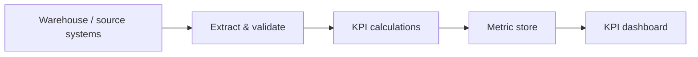

# Data Pipeline Specification

The requirements for building the production pipeline that feeds the KPI
dashboard. Anything not evidenced is marked **Not specified** and must be
supplied before build.

## Data warehouse / source of record

- Guidewire PolicyCenter
- agent runtime
- platform
- telemetry

## Parameters to read

- **Inputs uploaded** — reads `platform` via `count of raw sources uploaded`
- **Memory artifacts created** — reads `platform` via `count of artifact versions committed`
- **Token consumption** — reads `platform` via `sum of prompt and completion tokens across all agents`
- **Agent error rate** — reads `agent runtime` via `runs ending in error / total runs x 100`
- **Agents live** — reads `agent runtime` via `count of deployed agents reporting healthy`
- **Tokens per agent** — reads `agent runtime` via `sum of tokens grouped by agent`
- **API hits** — reads `telemetry` via `count of API calls grouped by endpoint`
- **API live status** — reads `telemetry` via `endpoints responding healthy / endpoints monitored x 100`
- **Data extraction time** — reads `agent runtime` via `elapsed time from upload accepted to conversion committed`
- **Extra Mortality Rating Override Rate** — reads `Guidewire PolicyCenter` via `The count of cases completing step S8 that feature a call to /submissions/{id}/rating/override, divided by the total number of cases completing step S8, multiplied by 100.`
- **Facultative Reinsurance Response Turnaround** — reads `Guidewire PolicyCenter` via `For cases completing step S10, calculate the duration from the S9 /reinsurance/referrals (POST) request timestamp to the S10 /reinsurance/referrals/{id} (GET) final response resolution timestamp. Report the 50th and 90th percentiles.`
- **Manual BMI Override and Correction Rate** — reads `Guidewire PolicyCenter` via `The count of cases completing step S6 where a manual change to height, weight, or BMI is executed, divided by the total number of cases completing step S6, multiplied by 100.`
- **Provisional Referral Lead Time** — reads `Guidewire PolicyCenter` via `For cases that execute step S4, calculate the duration between the timestamp of S1 (Register Application) completion and S4 (Send Provisional Referral) completion. Report the 50th and 90th percentiles of this distribution.`
- **Rated-Up Offer Acceptance Rate** — reads `Guidewire PolicyCenter` via `The count of policy issuance events (S15) following a counter-offer or rating-up event (S12), divided by the total count of counter-offers issued (S12), multiplied by 100.`

## Observability / monitoring APIs to call

- Observability / monitoring API to call — **Not specified**

## Pipeline requirements

- Schema validation on extract; reject rather than repair malformed records.
- Provenance capture for every metric value back to its source.
- Idempotent, incremental processing with observable failures.
- Benchmark values (category 4) carried through as fixed reference points.

## Missing specifications

- Observability/monitoring API endpoints and auth for category 1-3 metrics
- Refresh cadence, historical backfill window, and data retention policy
- Credentials/secret references for each source and API
